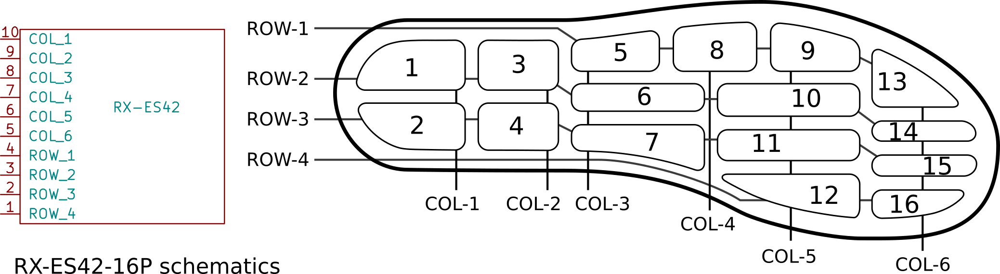
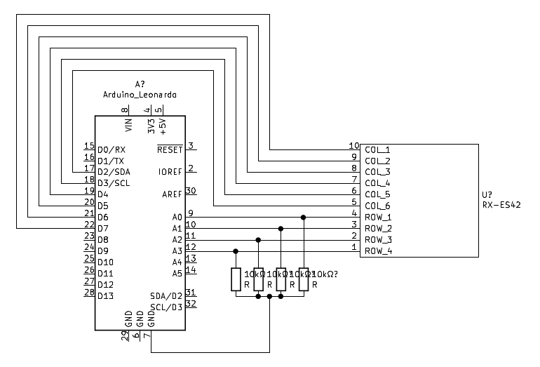

# connected_insole

The Connected Insole project began under the name of YAWO during the 2019 SDG Summer School at CRI.

Their goal was to produce a "connected insole ( a wearable insole) for diabetic patients suffering from Type 2 diabetes, consisting of several pressure sensors to give dynamic feedback of the patients’ plantar pressure".

This project aims at continuing their work by building an insole with pressure sensors that communicates via Bluetooth to a web app.

## How it works

The insole used, the RX-ES42-16P, is a 4×6 pressure sensor matrix between two plastic sheet. It consists of 16 pressure sensors organized as follows.

As a micro-controller, I used a Feather nrf 52 in the circuit below.

## Demo

You can test the Web app [here](https://drblobfish.github.io/connected_insole)

## Links

More information can be found on this [blog post](https://drblobfish.github.io/blog/2021/connected_insole/) as well as on [my CRI project page](https://projects.cri-paris.org/projects/q6iR8CaE/des).

## Context

I worked on this project as my 3rd semester student project in the [Frontiers of Life Bachelor](https://licence.learningplanetinstitute.org/fr) (Center for Interdisciplinary Research, University of Paris).

This project was performed with the help of the team at [CRI's MakerLab](https://makerlab.cri-paris.org)

